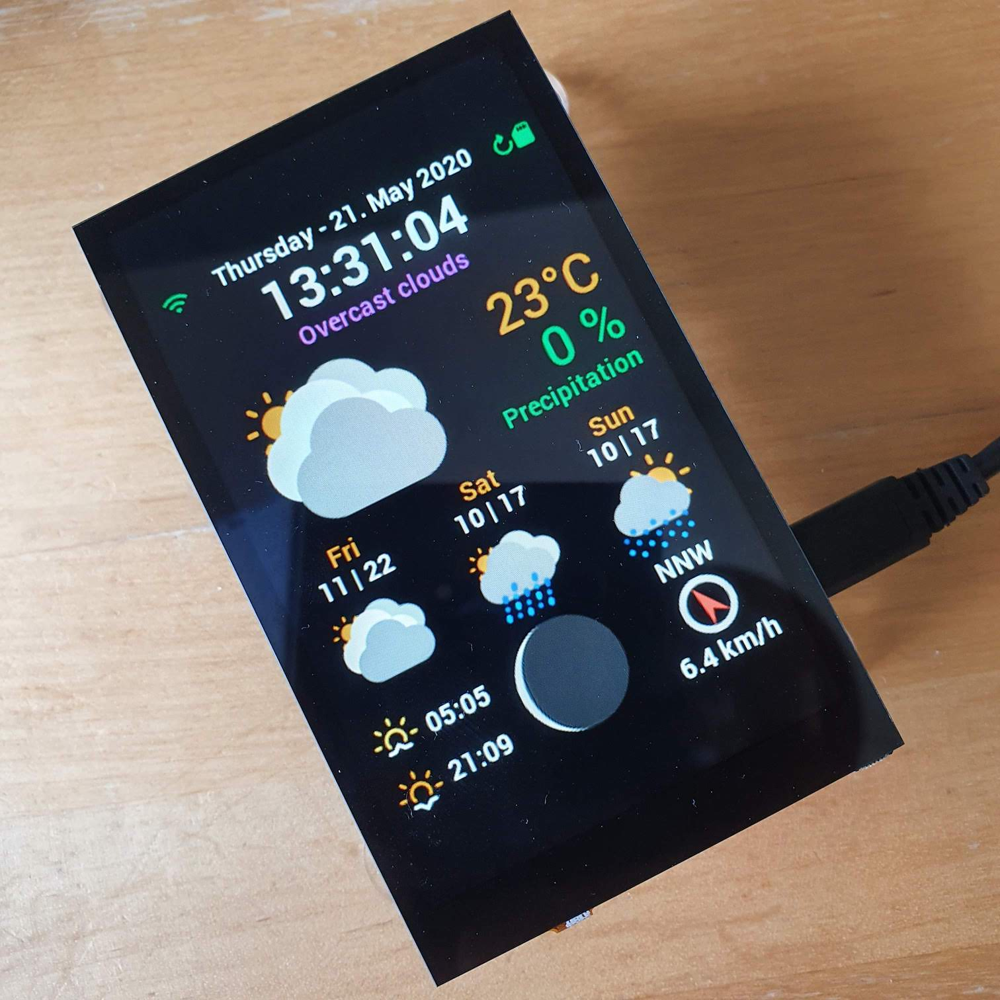
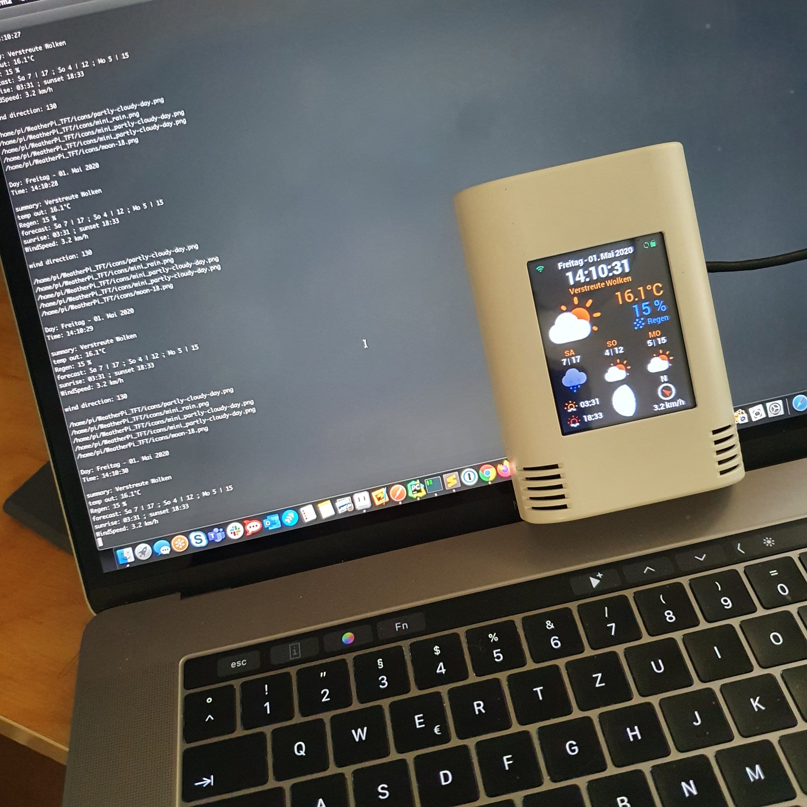
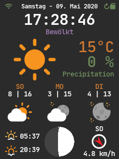
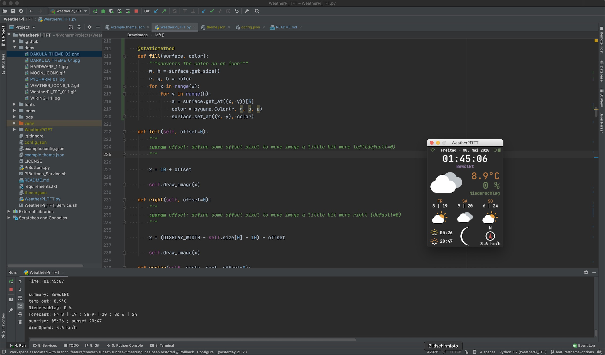

# WeatherPi_TFT

Working on @pimoroni HyperPixel4 Display and a Raspberry Pi 3 B+


Working on @HWHardsoft AZ-Touch-Pi0-Weather with ili9341 Display and a Raspberry Pi Zero W



## so it all began


a weather display for a raspberry pi and a adafruit (featherwing) TFT ili9341 display 


> written with love in python3.7


comes with 2 themes (default and darcula styled)

### all available weather icons in 2 sizes
thx @erikflowers for his [awesome weather-icons](https://github.com/erikflowers/weather-icons)

>I colored them and put a little glitter on it :)


### icons for moonphases
moon phase rendering: credits to @miyaichi for his [awesome fork](https://github.com/miyaichi/WeatherPi)

## Hardware and wiring

> i wrote this app on a mac with PyCharm and tested it quite a while. since it uses only standard python3 modules and libraries 
it should work on nearly everything that can run python3 and pygame.


> this tutorial is basically for running it on a raspberry pi (zero, 1, 2, 3) and a TFT display which matches up 
with chips like the ones from adafruit. as long as it uses standard spi it should work with the new `dtoverlay`module
in the latest jessie versions of raspbian... i think there is no need for a custom kernel. it's just a little bit 
configuration.

> i tested it with following TFT's:
> * [TFT FeatherWing - 2.4" 320x240 Touchscreen For All Feathers](https://www.adafruit.com/products/3315)
> * [Adafruit 2.4" TFT LCD with Touchscreen Breakout w/MicroSD Socket - ILI9341](https://www.adafruit.com/product/2478)
> * adafruit TFT's with ili9341 driver
> * pimoroni hyperpixel4

> no configuration needed for:
> * official raspberry pi 7" display
> * any HDMI display
> * skip all the TFT setup parts

### wiring


* this should explain how to wire up your display

```
SDO (MISO) TFT Data Out SPI_MISO    = GPIO09
SDI (MOSI) TFT Data In  SPI_MOSI    = GPIO10
SCK TFT Clock           SPI_CLK     = GPIO11

CS TFT Chip Select      SPI_CE0_N   = GPIO08
D/C TFT Data / Command              = GPIO24

RESET Reset                         = GPIO23
 
GND Ground                          = GND
VCC 3V3 supply                      = +3V3 or 5V
```

* optional if you like to use the included PiButtons script
```
BUTTON 1    used for restart app    = GPIO19
BUTTON 2    used for shutdown pi    = GPIO26
```
* give you the option to put some function on a hardware button (like restart the WeatherPiTFT service, shutdown/reboot your Pi, change display brightness, etc.)
* feel free to add your own functions in `PiButtons.py`


## buy complete hardware kit

You can also buy a complete set and build it yourself from my friend Hartmut over at his shop

 
> **[BUY HERE](https://www.hwhardsoft.de/english/projects/az-touch-pi0/)**


## Setup your Pi

### install jessie to a sd card and update

* get the latest [NOOBS](https://www.raspberrypi.org/downloads/noobs/) installer
```
https://www.raspberrypi.org/downloads/noobs/
```
> i used NOOBS v2.1.0 which was the latest version for now

### setup the SD card

follow the instructions from [raspberrypi.org](https://www.raspberrypi.org/documentation/installation/installing-images/README.md) to setup your sd card and operating system


### the first boot

finish your setup by following [this guide](https://projects.raspberrypi.org/en/projects/raspberry-pi-getting-started/4)

### enable SPI

enable SPI in [raspi-config](https://www.raspberrypi.org/documentation/configuration/raspi-config.md) - Interfacing Options

### connect to your WiFi

to connect to a wifi network follow this [guide](https://www.raspberrypi.org/documentation/configuration/wireless/README.md)

### update all tools

* when your connected to your wifi open up a terminal and type:
```bash
sudo apt-get update -y && sudo apt-get upgrade -y
```

### set up the TFT

#### for ili9341 displays from adafruit

for other displays like this you may have to build your own kernel module or find it from your seller.

* in /boot/config.txt, add in the following at the bottom 
```
# TFT display and touch panel
dtoverlay=rpi-display
dtparam=rotate=0
```

* change /boot/cmdline.txt to add the following to the end of the existing line
```
fbcon=map:10 fbcon=font:VGA8x8 logo.nologo
```


#### for Pimoroni Hyperpixel4

just change `"FRAMEBUFFER": "/dev/fb1"` to `"FRAMEBUFFER": "/dev/fb0"` later in your [config file](#edit-the-configjson-file)

you can also change `"FPS"` to `60` and `"AA"` to `true` for mx quality and frames per second. but 30 is more than enough.

it's just needed for the particle simulation for precipitation types like rain and snow. 

Everything from 15-30 fps should give you decent animations.

## install and configure WeatherPi_TFT

```bash
git clone https://github.com/LoveBootCaptain/WeatherPi_TFT.git
cd WeatherPi_TFT
rm -rf docs/
```

### install the dependencies in python3

since the script has to be run by a root user you have to install the dependencies with `sudo`

```
sudo pip3 install -r requirements.txt
```

### create a ram disk to protect your sd card

**NEW PLEASE UPDATE**

WeatherPiTFT will write a json file to your Pi after updating the weather data from the api provider.

this process will reduce writing to your sd card, cause we're writing it only to RAM.

ramdisk will only be used in production mode. means you have set your `"ENV"` to `"Pi"` which is default when you followed this guide.

you may also consider using great tooling for writing all logs to ram from @azlux: [log2ram](https://github.com/azlux/log2ram)

```
sudo mkdir /mnt/ramdisk
sudo nano /etc/fstab
```
add the following line right at the end of the opened file

`size=5M` specifies the size of the reserved ram (5M is more than enough)
```
tmpfs /mnt/ramdisk tmpfs nodev,nosuid,size=5M 0 0
```

`CTRL-O` to save and `CTRL-X` to quit nano

finally mount the ram disk and reboot your Pi

```
sudo mount -a
sudo reboot
```

while your Pi reboots grep your API key ...

### get an api key from weatherbit.io

* go to [weatherbit.io](https://www.weatherbit.io/)
* and register to get an API key

### add API key and other options to the config file

when your Pi has rebooted

#### create a new config-file
```bash
cd
cd WeatherPi_TFT
cp example.config.json config.json
```
#### edit the config.json file
```
nano config.json
```
#### configure your display options    
```
  "DISPLAY": {
    "WIDTH": 240,
    "HEIGHT": 320,
    "FPS": 30,
    "AA": false,
    "FRAMEBUFFER": "/dev/fb1",
    "PWM": false,
    "SHOW_FPS": true,
    "SHOW_API_STATS": true,
    "MOUSE": true
  },
``` 
* as long as you configure a 3:4 ratio the dashboard will be scaled
* `FPS` is used for pygame internal ticks - 30 fps is more than enough to render clock transitions and precipitation animations smoothly
* `AA` turns antialiasing on and off (leave it on a Pi Zero off, it is performance heavy and higher FPS)
* set `FRAMEBUFFER` according to your display, some use fb0 (e.g. @pimoroni HyperPixel4) some fb1 (most ili9341 from @adafruit), for local development or HDMI displays set it to `false`
* set `PWM` to your GPIO pin if your display support pwm brightness (HyperPixel supports GPIO 19 for pwm brightness) - may need some code adjustments on your side depending on your display (some are bright enough with pwm 25, some ore not) otherwise set it to `false`
* `SHOW_FPS` show the current fps on the display
* `SHOW_API_STATS` show how many API calls are left over (resets every midnight UTC)
* `MOUSE` enable/disable mouse pointer - needed for local development, better leave it disabled

#### configure weatherbit.io settings

* replace `xxxxxxxxxxxxxxxxxxxxxxxxx` in  `"WEATHERBIT_IO_KEY": "xxxxxxxxxxxxxxxxxxxxxxxxx"` with your own API key
* replace `en` in `"WEATHERBIT_LANGUAGE": "en"` with your preferred language
* replace `de` in `"WEATHERBIT_COUNTRY": "de"` with your country
* replace `10178` in `"WEATHERBIT_POSTALCODE": 10178` with your zip code / postal code (this example-location zip code is from berlin city, germany)
* for language-support, units, etc please refer to -> **[weatherbit API Docs](https://www.weatherbit.io/api)**

#### localise hardcoded strings and ISO settings
```
  "LOCALE": {
    "ISO": "en_GB",
    "RAIN_STR": "Rain",
    "SNOW_STR": "Snow",
    "PRECIP_STR": "Precipitation",
    "METRIC": true
  },
```
* change `"ISO"` and `"METRIC"` according to your needs
* `"METRIC": true` will get all weather data units as metric system, change to `false` if you prefer imperial styled units
    * `°C` will be `°F` and `km/h` will be `mph 
    * will also change the request parameter `untis` for the api request (see [weatherbit API Docs](https://www.weatherbit.io/api) for more details)

#### timer options
```
  "TIMER": {
    "UPDATE": 420,
    "RELOAD": 30
  },
```
* the `UPDATE` timer defines how often the API will be called in seconds - 7min will give you enough API calls over the day
* `RELOAD` defines who often the information on the display will be updated 

### theme file and theme options
set your theme file [darcula.theme, light.theme or example.theme] in `config.json`
```
"THEME": "darcula.theme",
```

* inside your THEME you can specify with json file with theming information -> an example for the default theme is in the file `example.theme.json`
* you must also try the new `darcula.theme.json` which is an homage to **[jetBrains great darcula theme](https://plugins.jetbrains.com/plugin/12275-dracula-theme)** for their IDE's -> [see screenshots below](#darcula-styled-theme-with-another-font) 
    * you can change some basic theme information
    * change colors of status bar icons and the wind direction icon with the theme colors
        ```
        "RED" is used for errors in status bar icons and wind direction
        "BLUE" is used for sync and update in status bar icons and rain precip icon
        "GREEN" is used for everything fine in status bar icons
        ```
    * change every color of an image by adding a color `(r, g, b)` to the optional `fillcolor` parameter in the `DrawImage` class
    * change the time and date format according to your preferences
        * a good reference for strftime options can be found here [Python strftime()](https://www.programiz.com/python-programming/datetime/strftime)
        * for 12h clock with am and pm support you can use `"%I:%M:%S %p"` instead of `"%H:%M:%S"` for a 24h clock in `yourTheme.DATE_FORMAT.TIME`
        * for imperial like date format just change `"%A - %d. %b %Y"` to `"%A - %b %d %Y"` in `yourTheme.DATE_FORMAT.DATE`
    * or create your own theme with your fonts and add it to your config/theme`

### setup the services

sadly pygame doesn't like to work well with systemd... so it has to run as init.d service. 
maybe someone can help to solve this one time.

```bash
cd
cd WeatherPi_TFT
sudo cp WeatherPiTFT.sh /etc/init.d/WeatherPiTFT
sudo cp PiButtons.sh /etc/init.d/PiButtons
```

### run python with root privileges

* this is useful if you like to run your python scripts on boot and with sudo support in python 
```bash
sudo chown -v root:root /usr/bin/python3
sudo chmod -v u+s /usr/bin/python3
```

### setting up python3 as default interpreter

* this should start your wanted python version just by typing `python` in the terminal
* helps if you have projects in python2 and python3 and don't want to hassle with the python version in your service scripts

```bash
update-alternatives --install /usr/bin/python python /usr/bin/python2.7 1
update-alternatives --install /usr/bin/python python /usr/bin/python3.4 2
```

> you can always swap back to python2 with:
> ```
> update-alternatives --config python
> ```
> and choose your preferred version of python

* check if python3.x is now default with:
```bash
python --version
```

* it should say something like: 
```
Python 3.7.x
```

* if everything is set up and updated correctly:
```bash
sudo reboot
```

### test the services

* for the WeatherPiTFT Service
```bash
sudo service WeatherPiTFT start
sudo service WeatherPiTFT stop
sudo service WeatherPiTFT restart
sudo service WeatherPiTFT status
```
* for the PiButtons Service
```bash
sudo service PiButtons start
sudo service PiButtons stop
sudo service PiButtons restart
sudo service PiButtons status
```

* if this is doing what it should you can run the service every time you boot your pi
```bash
sudo update-rc.d WeatherPiTFT defaults
sudo update-rc.d PiButtons defaults
```

## Troubleshooting

* if you have any issues with setting up your `locale` please read the [issue #1](https://github.com/LoveBootCaptain/WeatherPi_TFT/issues/1)
* if some special characters of your language is not supported (e.g. like chinese characters) please read the [issue #1](https://github.com/LoveBootCaptain/WeatherPi_TFT/issues/1#issuecomment-269432142)

### WeatherPi_TFT in Chinese

* a good way to setup for chinese was given from @yifanshu02 **[here](https://github.com/LoveBootCaptain/WeatherPi_TFT/issues/1#issuecomment-269472167)**


### credits

* [squix78](https://github.com/squix78) for his [esp8266 weather station color](https://github.com/squix78/esp8266-weather-station-color) which inspired me to make it in python for a raspberry and another weather api
* [adafruit](https://github.com/adafruit) for [hardware](https://www.adafruit.com/) and [tutorials](https://learn.adafruit.com/)
* [weatherbit.io](https://www.weatherbit.io/) for weather api and [documentation](https://www.weatherbit.io/api)
* weather icons: [@erikflowers](https://github.com/erikflowers) [weather-icons](https://github.com/erikflowers/weather-icons), making them colorful was my work
* statusbar icons: [google](https://github.com/google) [material-design-icons](https://github.com/google/material-design-icons)
* default font: [google - roboto](https://fonts.google.com/)
* darcula font: [jetbrains - mono](https://www.jetbrains.com/lp/mono/)
* moon phase rendering: [@miyaichi for his awesome fork](https://github.com/miyaichi/WeatherPi) and great ideas

### screenshots

#### darcula styled theme with another font




