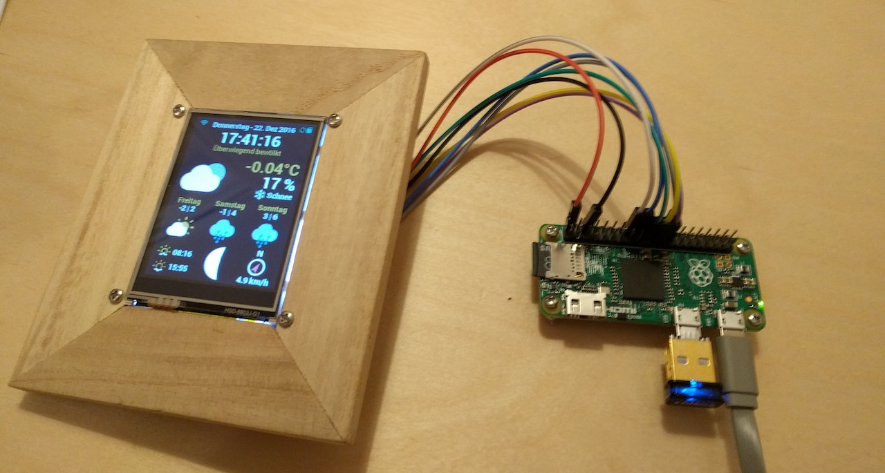
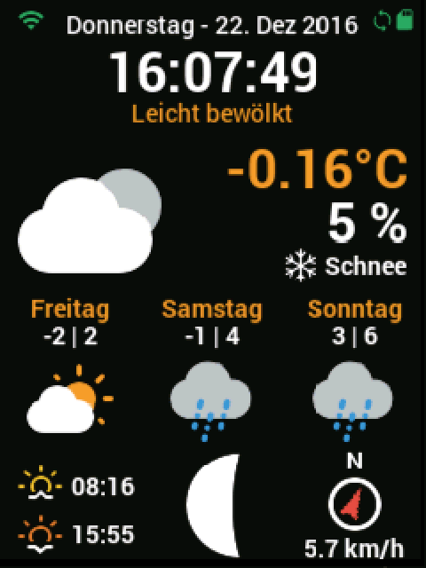
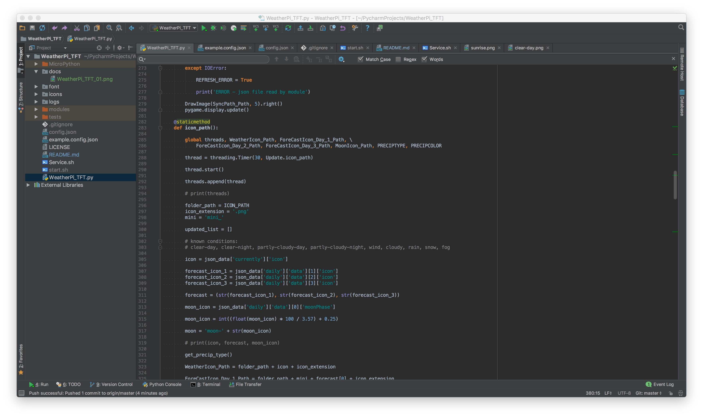
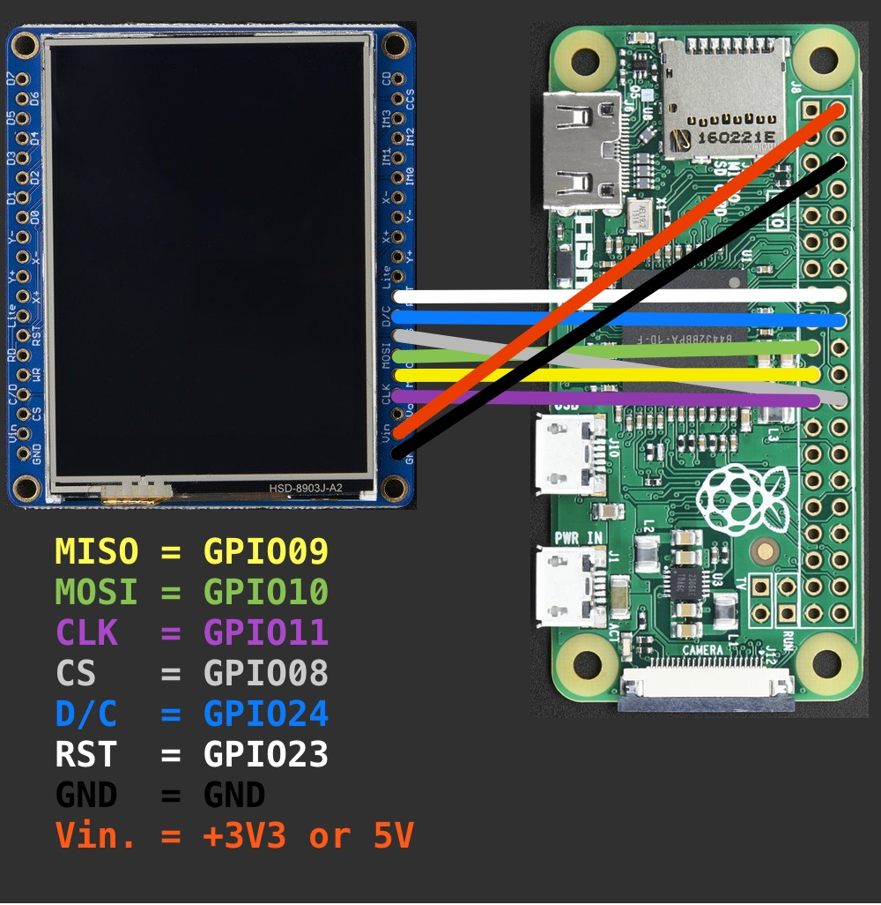
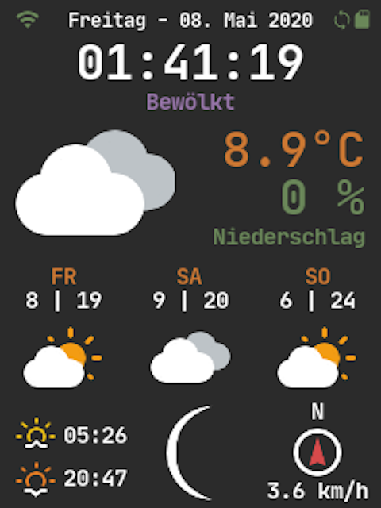

# WeatherPi_TFT



a weather display for a raspberry pi and a adafruit (featherwing) TFT ili9341 display 

> first of all, i'm a beginner in python... so don't be to hard to me... i'm still learning

> written with love in python3.7



### all available weather icons in 2 sizes


### icons for moonphases


## Hardware and wiring

> i wrote this app on a mac with PyCharm and tested it quite a while. since it uses only standard python3 modules and libraries 
it should work on nearly everything that can run python3 and pygame.



> this tutorial is basically for running it on a raspberry pi (zero, 1, 2, 3) and a TFT display which matches up 
with chips like the ones from adafruit. as long as it uses standard spi it should work with the new `dtoverlay`module
in the latest jessie versions of raspbian... i think there is no need for a custom kernel. it's just a little bit 
configuration.

> i tested it with following TFT's:
> * [TFT FeatherWing - 2.4" 320x240 Touchscreen For All Feathers](https://www.adafruit.com/products/3315)
> * [Adafruit 2.4" TFT LCD with Touchscreen Breakout w/MicroSD Socket - ILI9341](https://www.adafruit.com/product/2478)
> * adafruit TFT's with ili9341 driver

> no configuration needed for:
> * official raspberry pi 7" display
> * any HDMI display
> * skip all the TFT setup parts

### wiring



* this should explain how to wire up your display

```
SDO (MISO) TFT Data Out SPI_MISO    = GPIO09
SDI (MOSI) TFT Data In  SPI_MOSI    = GPIO10
SCK TFT Clock           SPI_CLK     = GPIO11

CS TFT Chip Select      SPI_CE0_N   = GPIO08
D/C TFT Data / Command              = GPIO24

RESET Reset                         = GPIO23
 
GND Ground                          = GND
VCC 3V3 supply                      = +3V3 or 5V
```

* optional if you like to use the included PiButtons script
```
BUTTON 1    used for restart app    = GPIO19
BUTTON 2    used for shutdown pi    = GPIO26
```
* give you the option to put some function on a hardware button (like restart the WeatherPiTFT service, shutdown/reboot your Pi, change display brightness, etc.)
* feel free to add your own functions in `PiButtons.py`

## Setup your Pi

### install jessie to a sd card and update

* get the latest [NOOBS](https://www.raspberrypi.org/downloads/noobs/) installer
```
https://www.raspberrypi.org/downloads/noobs/
```
> i used NOOBS v2.1.0 which was the latest version for now

### setup the SD card

follow the instructions from [raspberrypi.org](https://www.raspberrypi.org/documentation/installation/installing-images/README.md) to setup your sd card and operating system


### the first boot

finish your setup by following [this guide](https://projects.raspberrypi.org/en/projects/raspberry-pi-getting-started/4)

### enable SPI

enable SPI in [raspi-config](https://www.raspberrypi.org/documentation/configuration/raspi-config.md) - Interfacing Options

### connect to your WiFi

to connect to a wifi network follow this [guide](https://www.raspberrypi.org/documentation/configuration/wireless/README.md)

### update all tools

* when your connected to your wifi open up a terminal and type:
```bash
sudo apt-get update -y && sudo apt-get upgrade -y
```

## install and configure WeatherPi_TFT

```bash
git clone https://github.com/LoveBootCaptain/WeatherPi_TFT.git
cd WeatherPi_TFT
rm -rf docs/
```

### install the dependencies in python3

```
pip install -r requirements.txt
```

### get an api key from weatherbit.io

* go to [weatherbit.io](https://www.weatherbit.io/)
* and register to get an API key

### add API key and other options to the config file

* create a new config-file
```bash
cd
cd WeatherPi_TFT
cp example.config.json config.json
```
* edit the config.json file
```
nano config.json
```
* replace `xxxxxxxxxxxxxxxxxxxxxxxxx` in  `"WEATHERBIT_IO_KEY": "xxxxxxxxxxxxxxxxxxxxxxxxx"` with your own API key
* replace `en` in `"WEATHERBIT_LANGUAGE": "en"` with your preferred language
* replace `de` in `"WEATHERBIT_COUNTRY": "de"` with your country
* replace `10178` in `"WEATHERBIT_POSTALCODE": 10178` with your zip code / postal code (this example-location zip code is from berlin city, germany)
* for language-support, units, etc please refer to -> **[weatherbit API Docs](https://www.weatherbit.io/api)**

### set up the TFT

* in /boot/config.txt, add in the following at the bottom 
```
# TFT display and touch panel
dtoverlay=rpi-display
dtparam=rotate=0
```

* change /boot/cmdline.txt to add the following to the end of the existing line
```
fbcon=map:10 fbcon=font:VGA8x8 logo.nologo
```

### setup the services

```bash
cd
cd WeatherPi_TFT
sudo cp WeatherPi_TFT_Service.sh /etc/init.d/WeatherPiTFT
sudo cp PiButtons_Service.sh /etc/init.d/PiButtons
sudo chmod +x /etc/init.d/WeatherPiTFT
sudo chmod +x /etc/init.d/PiButtons
sudo chmod +x Weatherpi_TFT.py
sudo chmod +x PiButtons.py
```

### run python with root privileges

* this is useful if you like to run your python scripts on boot and with sudo support in python 
```bash
sudo chown -v root:root /usr/bin/python3
sudo chmod -v u+s /usr/bin/python3
```

### setting up python3 as default interpreter

* this should start your wanted python version just by typing `python` in the terminal
* helps if you have projects in python2 and python3 and don't want to hassle with the python version in your service scripts

```bash
update-alternatives --install /usr/bin/python python /usr/bin/python2.7 1
update-alternatives --install /usr/bin/python python /usr/bin/python3.4 2
```

> you can always swap back to python2 with:
> ```
> update-alternatives --config python
> ```
> and choose your preferred version of python

* check if python3.x is now default with:
```bash
python --version
```

* it should say something like: 
```
Python 3.4.x
```


### update all python modules

* open up a python console
```bash
python
```

* than run this line by line
```python
import pip
from subprocess import call
for dist in pip.get_installed_distributions():
    call("pip install --upgrade " + dist.project_name, shell=True)
```

* if everything is set up and updated correctly:
```bash
sudo reboot
```

### test the services


* for the WeatherPiTFT Service
```bash
sudo service WeatherPiTFT start
sudo service WeatherPiTFT stop
sudo service WeatherPiTFT restart
sudo service WeatherPiTFT status
```
* for the PiButtons Service
```bash
sudo service PiButtons start
sudo service PiButtons stop
sudo service PiButtons restart
sudo service PiButtons status
```

* if this is doing what it should you can run the service every time you boot your pi
```bash
sudo update-rc.d WeatherPiTFT defaults
sudo update-rc.d PiButtons defaults
```

## Troubleshooting

* if you have any issues with setting up your `locale` please read the [issue #1](https://github.com/LoveBootCaptain/WeatherPi_TFT/issues/1)
* if some special characters of your language is not supported (e.g. like chinese characters) please read the [issue #1](https://github.com/LoveBootCaptain/WeatherPi_TFT/issues/1#issuecomment-269432142)

### WeatherPi_TFT in Chinese

* a good way to setup for chinese was given from @yifanshu02 **[here](https://github.com/LoveBootCaptain/WeatherPi_TFT/issues/1#issuecomment-269472167)**


### credits

* [squix78](https://github.com/squix78) for his [esp8266 weather station color](https://github.com/squix78/esp8266-weather-station-color) which inspired me to make it in python for a raspberry and another weather api
* [adafruit](https://github.com/adafruit) for [hardware](https://www.adafruit.com/) and [tutorials](https://learn.adafruit.com/)
* [darksky / forecast.io](https://darksky.net) weather api and [documentation](https://darksky.net/dev/)
* icons: [fa2png](http://fa2png.io/), making them colorful was my work
* fonts: [google](https://fonts.google.com/)


### screenshots

#### darcula styled theme with another font




